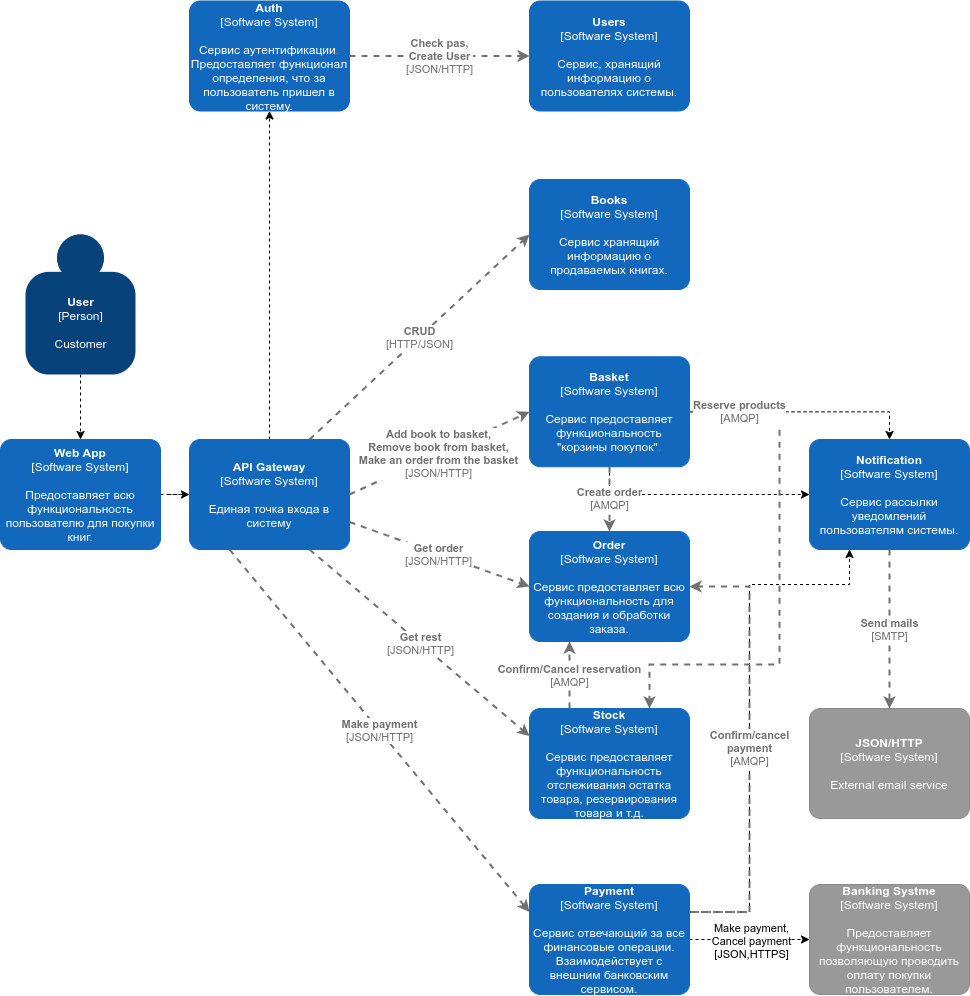

# Выпускной проект Otus
**Тема:**  Интеренет магазин книг
## Описание
### Use cases
Сущности
**Seller** - продавец, пользователь системы
 **Customer** - покупатель, пользователь системы
 **System** - система в общем смысле, объединение сервисов, которые 
совместно предоставляют пользователям системы весь требуемый функционал  
#### Загрузка книг
1. **Seller** загружает yml/csv файл с книгами
1. **System** добавляет книги в БД 
1. Книги доступены для **Customer**
#### Пользователь успешно покупает книги
1. **Customer** получает список книг 
1. **Customer** выбирает книги из списка
1. **Customer** переходит на страницу книги
1. **Customer** добавляет книгу в корзину
1. **System** создает корзину и добавляет книгу
1. **Customer** возвращается на страницу со списком книг
1. **Customer** добавляет книгу в корзину
1. **System** добавляет книгу в сущетсвующую корзину
1. **Customer** переходит на "страницу" корзины
1. **Customer** формирует заказ
1. **Customer** производит оплату заказа
1. **System** высылает уведолмение на почту **Seller** о сформированном
заказе
1. **System** высылает уведолмение на почту **Customer** о
сформированном заказе
1. **Customer** ожидает подтверждение заказа от **Seller**
1. **Seller** получает уведолмение на почту с ссылкой на заказ
1. **Seller** переходит по "ссылке" и **подтверждает** заказ
1. **System** отправляет уведолмение на почту **Customer** о 
подтверждении заказа
1. **Customer** получает уведолмение о подтверждении заказа на почту
1. **Seller** отправляет заказ **Customer**
1. **Customer** получает заказ
#### Пользователь ищет книгу на сайте
1. **Customer** переходит на главную страницу сайта
1. **Customer** вводит в поисковую строку название искомой книги
1. **Customer** получает список подходящих книг

## Архитектура проекта

### Серивсы 
#### User
Сервис хранит информацию о пользователях. Предоставляет интерфейс для  
создания, обнолвения и удаления информации о пользователях.
##### Входящие запросы от
* **Auth**, REST
##### Ссылка на репозиторий
[https://github.com/jawello/users-otus](https://github.com/jawello/users-otus)
#### Auth
Сервис атентификации. Проверяет аутентифицирован ли пользовтель, выдает  
cookie с сессией, удалеят сессию при logout.
##### Входящие запросы
* **API gateway**
##### Исходящие запросы
* **User**, REST
##### Ссылка на репозиторий
[https://github.com/jawello/auth-otus](https://github.com/jawello/auth-otus)
#### Books
Сервис предоставляет доступ к книгам для пользователей, позволяет  
добавлять книги магазинам.
##### Входящий трафик
* **API Gateway**
* **Basket**, REST
##### Ссылка на репозиторий
[https://github.com/jawello/books-otus](https://github.com/jawello/books-otus)
#### Basket
Сервис для создания и наполнения корзины книгами. 
##### Входящий трафик
* **API Gateway**
##### Исходящий трафик
* **Book_Shop**, REST
* Создает сообщения в очередь о необходимости создать заказ
(consumer **Order**)
#### Order
Сервис отвечает за получение информации о заказах пользователя и статуса  
заказов
##### Входящий трафик
* **API Gateway**
* Подписан на сообщения:
  * Создать заказ
  * Заказ подтвержден магазином
  * Заказ оплачен пользователем
#### Stock
Сервис предоставляет функциональность отслеживания остатка товара,
резервирование товара и т.д.
##### Входящий трафик
* **API Gateway**
* Подписан на сообщения:
  * Резервирование продукта
##### Исходящий трафик
* Создает сообщения по подтверждение резервирования товара
#### Payment
Сервис оплаты заказов. 
##### Входящий трафик
* **API Gateway**
* Подписан на сообщение - перевести деньги продавцу, отмена оплаты
##### Исходящий трафик
* Внешний billing, REST
* Создает сообщение на подтверждение оплаты заказов
#### Notification
Сервис рассылки уведомлений и запросов на подвтерждение. 
##### Входящий трафик
* Подписан на сообщения в очереди, которые подразумевают отправку
запросов.

