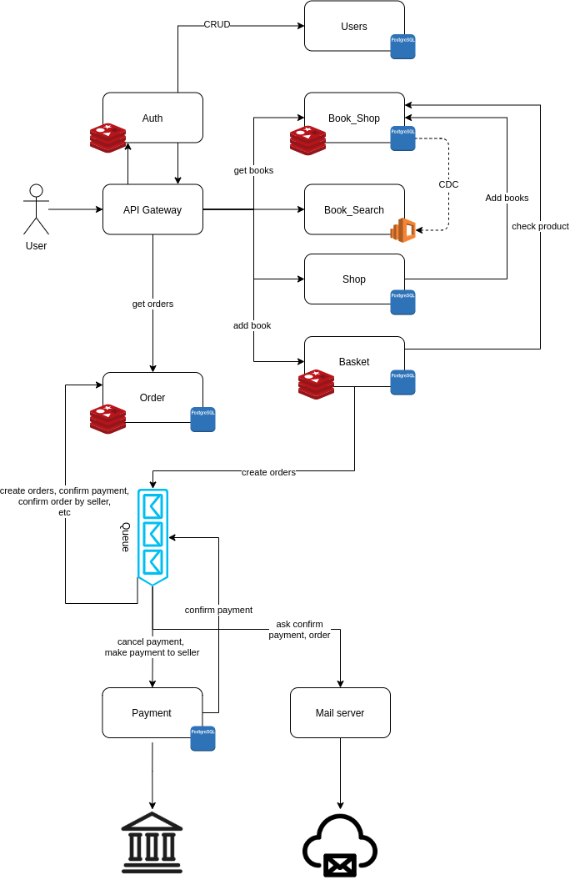

# Выпускной проект Otus
**Тема:**  Marketplace книг
## Описание
### Use cases
Сущности

 **Customer** - покупатель, пользователь системы
 
 **Seller** - продавец, пользователь системы. Все продавцы поддерживают
 одинаковые способы оплаты (только безналичные)
 
 **System** - система в общем смысле, объединение сервисов, которые 
совместно предоставляют пользователям системы весь требуемый функционал  
#### Загрузка книг
1. **Seller** загружает yml/csv файл с книгами
1. **System** добавляет книги в в свою БД 
1. Книги доступены для **Customer**
#### Пользователь успешно покупает книги
1. **Customer** получает список книг 
1. **Customer** выбирает книги из списка
1. **Customer** переходит на страницу книги
1. **Customer** добавляет книгу в корзину, с указанием **Seller**'а
1. **System** создает корзину
1. **Customer** возвращается на страницу со списком книг
1. **Customer** добавляет книгу в корзину, с указанием **Seller**'а
1. **System** создает корзину или добавляет книгу в сущетсвующую
1. **Customer** переходит на страницу корзин
1. **Customer** выбирает способ оплаты
1. **Customer** формирует заказ (или несколько, если книги предоставляют
разные **Seller**'ы)
1. **Customer** производит оплату заказа
1. **System** резервирует деньги **Customer** на своем счету
1. **System** высылает уведолмение на почту **Seller** о сформированном
заказе
1. **System** высылает уведолмение на почту **Customer** о
сформированном заказе
1. **Customer** ожидает подтверждение заказа от **Seller**
1. **Seller** получает уведолмение на почте с ссылкой на заказ
1. **Seller** переходит по ссылке и **подтверждает** заказ
1. **System** отправляет уведолмение на почту **Customer** о 
подтверждении заказа
1. **Customer** получает уведолмение о подтверждении заказа на почту
1. **System** отправляет денежные переводы каждому **Seller**'у
1. **Seller** отправляет заказ **Customer**
1. **Customer** получает заказ
#### Пользователь ищет книгу на сайте
1. **Customer** переходит на главную страницу сайта
1. **Customer** вводит в поисковую строку название искомой книги
1. **Customer** получает список подходящих книг

## Архитектура проекта

### Серивсы 
#### User
Сервис хранит информацию о пользователях. Предоставляет интерфейс для создания,
обнолвения и удаления информации о пользователях.
##### Входящие запросы от
* **Auth**, REST 
#### Auth
Сервис атентификации. Проверяет аутентифицирован ли пользовтель, выдает cookie с сессией, 
удалеят сессию при logout.
##### Входящие запросы
* **API gateway**
##### Исходящие запросы
* **User**, REST
#### Book_Shop
Сервис предоставляет доступ к книгам для пользователей, позволяет добавлять книги магазинам.
##### Входящий трафик
* **API Gateway**
* **Basket**, REST
##### Исходящий трафик
* **Book_Search** (CDC из PostgreSQL в Elastic Search)
#### Book_Search
Сервис для быстрого поиска книг.
##### Входящий трафик
* **Book_Shop** (CDC из PostgreSQL в Elastic Search)
#### Shop
Сервис предоставляет информацию о магазинах книг, позволяет создавать и редактивровать информацию
пользователям, которые создали магазин (авторизация происходит в сервисе **Shop**), 
предоставляет API для добавления книг.
##### Входящий трафик
* **API Gateway**
##### Исходящий трафик
* **Book_Shop**, REST 
#### Basket
Сервис для создания и наполнения корзины книгами. 
##### Входящий трафик
* **API Gateway**
##### Исходящий трафик
* **Book_Shop**, REST
* Создает сообщения в очередь о необходимости создать заказ (consumer **Order**)
#### Order
Сервис отвечает за получение информации о заказах пользователя и статуса заказов
##### Входящий трафик
* **API Gateway**
* Подписан на сообщения:
  * Создать заказ
  * Заказ подтвержден магазином
  * Заказ оплачен пользователем
#### Payment
Сервис оплаты заказов. 
##### Входящий трафик
* **API Gateway**
* Подписан на сообщение - перевести деньги продавцу, отмена оплаты
##### Исходящий трафик
* Внешний billing, REST
* Создает сообщение на подтверждение оплаты заказов
#### Notification
Сервис рассылки уведомлений и запросов на подвтерждение. 
##### Входящий трафик
* Подписан на сообщения в очереди, которые подразумевают отправку запросов.
